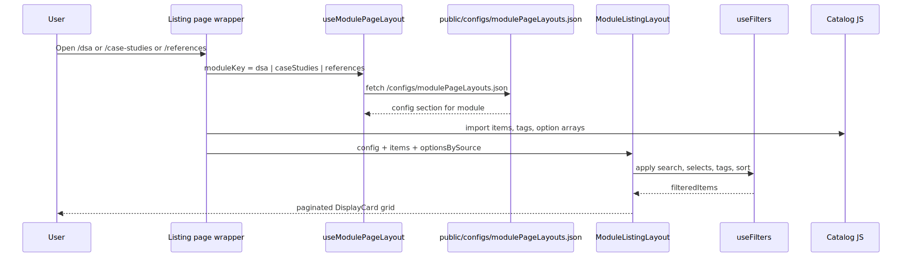
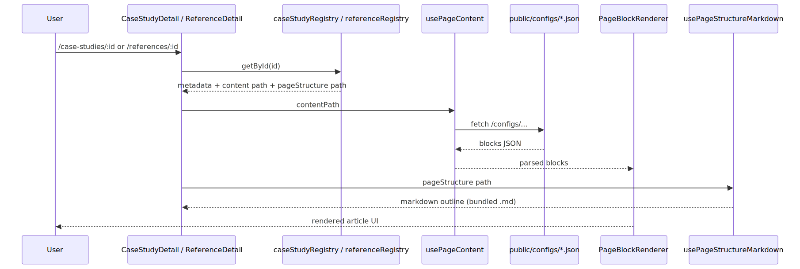
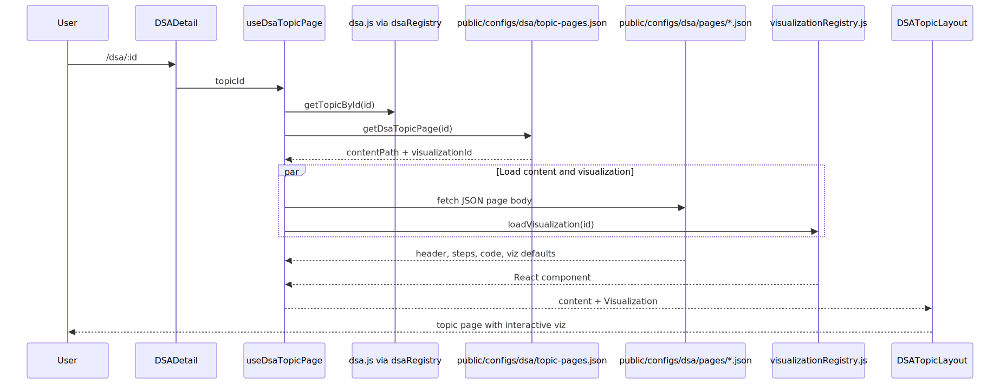

# Deverse — Architecture Reference

This document describes how the Deverse frontend is structured: where data lives, how registries resolve paths, how hooks load content, how layouts compose pages, and how DSA visualizations are wired.

**Regenerate diagrams:** `npm run docs:diagrams` (requires `@mermaid-js/mermaid-cli` + `puppeteer` devDependencies).

---

## Table of Contents

1. [High-level overview](#1-high-level-overview)
2. [Folder structure](#2-folder-structure)
3. [Public JSON documents](#3-public-json-documents)
4. [Catalog data vs registries](#4-catalog-data-vs-registries)
5. [Listing pages](#5-listing-pages)
6. [Declarative detail pages](#6-declarative-detail-pages)
7. [DSA detail pages](#7-dsa-detail-pages)
8. [Prebuilt modules, projects & developer tools](#8-prebuilt-modules-projects--developer-tools)
9. [Hooks reference](#9-hooks-reference)
10. [Layouts](#10-layouts)
11. [Visualization system](#11-visualization-system)
12. [Routing](#12-routing)
13. [Adding new content](#13-adding-new-content)

---

## 1. High-level overview

Deverse is a **React + Vite + MUI** learning platform with no backend API. Content is split into:

| Layer | Role | Examples |
|-------|------|----------|
| **Catalog JS** (`src/data/*.js`) | Card metadata for listings; lookup by `id` | `dsa.js`, `caseStudies.js`, `references.js`, `prebuiltModules.js`, `projects.js`, `developerTools.js` |
| **Public JSON** (`public/configs/`) | Page bodies, DSA topic content, listing UI config | `aggregation-pipeline-mastery.json`, `dsa/pages/array.json`, `projects/google-docs-clone.json` |
| **Bundled markdown** (`pageStructures/`) | Authoring outlines (not rendered as articles) | `caseStudies/AggregationPipelineMastery.md`, `projects/GoogleDocsClone.md` |
| **React visualizations** (`src/components/visualizations/`) | Interactive DSA canvases | `ArrayOperationsVisualization.jsx` |

### System diagram



**Request flow in one sentence:** routes render thin page wrappers → hooks/registries resolve paths → layouts render UI → declarative JSON or lazy React components fill the main column.

---

## 2. Folder structure

```
deverse/
├── public/
│   └── configs/
│       ├── modulePageLayouts.json    # Listing UI for DSA, case studies, references
│       ├── caseStudies/*.json        # Declarative block pages
│       ├── references/*.json
│       ├── prebuiltModules/*.json
│       ├── projects/*.json
│       ├── dsa/
│       │   ├── topic-pages.json      # topic id → contentPath + visualizationId
│       │   ├── topic-visualizations.json
│       │   └── pages/*.json          # DSA topic page content (header, code, steps, viz defaults)
│       └── components/showcase.json
│
├── pageStructures/                   # Markdown outlines (bundled at build time)
│   ├── caseStudies/
│   └── references/
│
├── architecture/
│   ├── architecture.md               # This file
│   └── diagrams/                     # .mmd sources + generated .svg
│
└── src/
    ├── App.jsx                       # Routes
    ├── data/
    │   ├── dsa.js                    # DSA catalog (50+ topics, active filter)
    │   ├── caseStudies.js            # Case study catalog
    │   ├── references.js             # Reference catalog + filter/search helpers
    │   ├── prebuiltModules.js        # Microservice suite catalog
    │   ├── projects.js               # Full-stack project catalog
    │   ├── developerTools.js         # External tool links (listing only)
    │   └── registries/
    │       ├── loadPublicJson.js     # fetch('/configs/...')
    │       ├── caseStudyRegistry.js
    │       ├── referenceRegistry.js
    │       ├── dsaRegistry.js
    │       ├── prebuiltModuleRegistry.js
    │       ├── projectRegistry.js
    │       ├── developerToolRegistry.js
    │       └── moduleListingRegistry.js
    ├── hooks/
    │   ├── useModulePageLayout.js
    │   ├── useFilters.js
    │   ├── usePageContent.js
    │   ├── useDsaTopicPage.js
    │   └── usePageStructureMarkdown.js
    ├── layouts/
    │   ├── MainLayout.jsx
    │   ├── ModuleListingLayout.jsx
    │   ├── DSATopicLayout.jsx
    │   └── CatalogDetailLayout.jsx
    ├── pages/                        # Thin route wrappers
    └── components/
        ├── renderer/                 # PageBlockRenderer, PageContent
        └── visualizations/           # visualizationRegistry + topic components
```

---

## 3. Public JSON documents

Files under `public/` are served at the site root. A path like `/configs/dsa/pages/array.json` maps to `public/configs/dsa/pages/array.json`.

### How paths are resolved



`loadPublicJson` and `usePageContent` accept paths in these forms:

| Path pattern | Loader |
|--------------|--------|
| `/configs/...` | `fetch('/configs/...')` at runtime |
| `/public/configs/...` | Normalized to `/configs/...` then fetched |
| `pageStructures/...` (no `/configs` prefix) | Vite glob import of bundled JSON under `pageStructures/` |

### Public config inventory

| File | Purpose |
|------|---------|
| `modulePageLayouts.json` | Declarative filters, sorts, cards, pagination per module (all listing keys) |
| `caseStudies/*.json` | Block-based article content (`blocks[]` + optional `meta`) |
| `references/*.json` | Same block model for reference articles |
| `prebuiltModules/*.json` | Microservice suite detail pages |
| `projects/*.json` | Full-stack project detail pages (may include `mermaidDiagram` blocks) |
| `dsa/topic-pages.json` | Registry: which topics have full pages + paths |
| `dsa/pages/*.json` | DSA topic shell content (header, code, steps, `visualization.defaults`) |
| `dsa/topic-visualizations.json` | Metadata catalog (kind, label, status) — documentation-oriented |

### Block page JSON shape (case studies / references)

```json
{
  "page": "/case-studies/aggregation-pipeline-mastery",
  "blocks": [
    { "type": "sectionHeader", "title": "...", "description": "..." },
    { "type": "subsection", "title": "...", "blocks": [ ... ] }
  ]
}
```

`parsePageContent()` normalizes raw JSON into `{ meta, blocks }` for `PageBlockRenderer`.

---

## 4. Catalog data vs registries

**Pattern:** data files hold catalogs and business helpers; registries re-export catalogs and expose **path resolvers** (and for DSA, public JSON loaders).



### `caseStudyRegistry.js`

- **Imports from:** `src/data/caseStudies.js`
- **Exports:** `caseStudies`, `allTags`, `categories`, `getBlogById`
- **Resolvers:** `resolveCaseStudyContentPath(id)`, `resolveCaseStudyPageStructurePath(id)`

### `referenceRegistry.js`

- **Imports from:** `src/data/references.js`
- **Exports:** `references`, `referenceAllTags`, `referenceTypes`, `referenceLevels`, `getReferenceById`
- **Resolvers:** `resolveReferenceContentPath(id)`, `resolveReferencePageStructurePath(id)`

### `dsaRegistry.js`

- **Imports catalog from:** `src/data/dsa.js` (`dsaTopics`, filter option arrays, `getTopicById`)
- **Loads from public:**
  - `topic-pages.json` → `getDsaTopicPage(topicId)`
  - `pages/*.json` → `loadDsaTopicContent(contentPath)`
  - `topic-visualizations.json` → `loadTopicVisualizationsCatalog()` (metadata)

### `moduleListingRegistry.js`

- **Loads:** `public/configs/modulePageLayouts.json`
- **API:** `loadModulePageLayouts()`, `getModulePageLayout(moduleKey)` — keys include `dsa`, `caseStudies`, `references`, `prebuiltModules`, `projects`, `developerTools`

### `prebuiltModuleRegistry.js`

- **Imports from:** `src/data/prebuiltModules.js`
- **Resolvers:** `resolvePrebuiltModuleContentPath`, `resolvePrebuiltModulePageStructurePath`
- **Use case:** E-commerce / Uber / Facebook **microservice building blocks** with per-service explanations and GitHub links

### `projectRegistry.js`

- **Imports from:** `src/data/projects.js`
- **Resolvers:** `resolveProjectContentPath`, `resolveProjectPageStructurePath`
- **Use case:** Clone-style **full-stack projects** (Docs, Meet, Calendar, etc.) with architecture diagrams in JSON (`mermaidDiagram` blocks)

### `developerToolRegistry.js`

- **Imports from:** `src/data/developerTools.js`
- **No detail routes** — each catalog row has an external `href`; `DisplayCard` opens `_blank`

### Catalog entry fields (detail-ready items)

Case studies and references can include:

```js
{
  id: 'kafka-basics',
  title: '...',
  active: true,                              // only active items appear on listing
  content: '/configs/references/kafka-basics.json',
  pageStructure: '/pageStructures/references/KafkaBasics.md',
}
```

DSA catalog entries live in `dsa.js`; full pages are gated by `dsa/topic-pages.json`, not only `active`.

---

## 5. Listing pages

All three listing routes share **`ModuleListingLayout`** and the same data flow.



### Steps

1. **Page wrapper** (`DSA.jsx`, `CaseStudies.jsx`, `References.jsx`) imports catalog data from the appropriate registry.
2. **`useModulePageLayout(moduleKey)`** fetches `public/configs/modulePageLayouts.json` and selects `dsa` | `caseStudies` | `references`.
3. **`ModuleListingLayout`** receives `config`, `items`, `allTags`, `optionsBySource`.
4. **`useFilters`** applies search, select filters, tag chips, and sort (driven by `config.filters`).
5. Results render as **`DisplayCard`** grid with pagination; `card.linkTemplate` (e.g. `/dsa/:id`) is interpolated per item.

### `modulePageLayouts.json` keys

| Key | Meaning |
|-----|---------|
| `header` | Back link, title, description |
| `filters.searchKeys` | Fields concatenated for text search |
| `filters.selects[].optionsSource` | Key into `optionsBySource` from the page wrapper |
| `filters.selects[].visibleWhen` | Conditional select visibility |
| `filters.sorts` | Sort options (`key` = item field, `direction`) |
| `card.linkTemplate` | Route template with `:id` placeholders |
| `pagination.pageSize` | Items per page |

---

## 6. Declarative detail pages

Case studies, references, prebuilt modules, and projects use the **same renderer pipeline**; only the catalog/registry differs. **`CatalogDetailLayout`** centralizes back navigation, chips, GitHub button, `PageContent`, and page-structure outline.



### `CaseStudyDetail.jsx` / `ReferenceDetail.jsx`

1. `useParams().id` → `getBlogById(id)` or `getReferenceById(id)` from registry.
2. If missing or `active: false` (references), show error or “not published”.
3. **Main column:** `<PageContent contentPath={item.content} />`
   - `usePageContent` → `fetch` JSON → `parsePageContent` → `PageBlockRenderer`
4. **Outline (optional):** `usePageStructureMarkdown(item.pageStructure)` loads bundled `.md` via Vite glob (`?raw`).

### `PageBlockRenderer`

Maps `block.type` to shared components (`sectionHeader`, `subsection`, `contentCard`, `list`, `alert`, `mermaidDiagram`, `basicTable`, etc.). Nested blocks are supported via `subsection` and `contentCard.nestedBlocks`.

---

## 7. DSA detail pages

DSA uses a **different detail pipeline**: catalog metadata in JS, page body in public JSON, visualization as a **lazy React component**.



### `DSADetail.jsx` → `useDsaTopicPage(topicId)`

| Step | Source | Result |
|------|--------|--------|
| Catalog row | `getTopicById(id)` from `dsa.js` | Title, tags, difficulty, description for cards/header |
| Page registration | `getDsaTopicPage(id)` from `topic-pages.json` | `{ contentPath, visualizationId }` or undefined |
| Content | `loadDsaTopicContent(contentPath)` | JSON object for `DSATopicLayout` |
| Visualization | `loadVisualization(visualizationId)` | React component from `visualizationRegistry.js` |

If the topic exists in the catalog but not in `topic-pages.json`, the user sees a “not wired yet” message with pointers to the registry files.

### `DSATopicLayout.jsx`

Adapts to content `kind`:

- **`data-structure`** (default): full-width viz, variants, code, hints
- **`algorithm`**: viz + sticky sidebar (algorithm steps + complexity)
- **`problem`**: statement, examples, viz, solution code

Passes `visualization.kind` and `visualization.defaults` into the loaded visualization component. The viz calls `onHighlightChange` to sync sidebar step highlights.

### Registered topics (example)

```json
// public/configs/dsa/topic-pages.json
{
  "array": {
    "contentPath": "/configs/dsa/pages/array.json",
    "visualizationId": "array"
  },
  "stack": { "contentPath": "/configs/dsa/pages/stack.json", "visualizationId": "stack" },
  "linked-list": { "contentPath": "/configs/dsa/pages/linked-list.json", "visualizationId": "linked-list" }
}
```

`visualizationRegistry.js` maps `visualizationId` → `import()` of the React file (code-split per topic).

---

## 8. Prebuilt modules, projects & developer tools

| Module | Listing route | Detail route | Detail? | Card link |
|--------|---------------|--------------|---------|-----------|
| **Prebuilt modules** | `/modules` | `/modules/:id` | Yes — service breakdowns + GitHub | `linkTemplate: /modules/:id` |
| **Projects** | `/projects` | `/projects/:id` | Yes — architecture + GitHub | `linkTemplate: /projects/:id` |
| **Developer tools** | `/tools` | — | No — external only | `item.href` (opens new tab) |

### Catalog helpers (each `src/data/*.js`)

All three catalogs export the same utility shape as `references.js`:

- `filterByCategory`, `filterByTag`, `filterByTags`
- `search*` (e.g. `searchPrebuiltModules`)
- `sort*` (e.g. `sortProjects`)
- `get*CategoryStats`, `get*TagStats`
- `get*ById` for detail lookup

Only **active** rows appear on listing pages (`active: true`). Inactive rows remain in the full catalog for future publishing.

### Sample active content

| Item | JSON content | Outline |
|------|--------------|---------|
| `ecommerce-microservices` | `public/configs/prebuiltModules/ecommerce-microservices.json` | `pageStructures/prebuiltModules/EcommerceMicroservices.md` |
| `google-docs-clone` | `public/configs/projects/google-docs-clone.json` (includes Mermaid diagram block) | `pageStructures/projects/GoogleDocsClone.md` |

Replace `githubUrl` placeholders in `prebuiltModules.js` / `projects.js` with your real repositories.

### Developer tools

Six starter cards (JSON Formatter, Regex 101, JWT.io, etc.) link straight to hosted tools. To add a tool: append a row in `developerTools.js` with `href: 'https://...'` and `active: true` — no `content` or registry path resolvers needed.

---

## 9. Hooks reference

| Hook | Used by | Responsibility |
|------|---------|----------------|
| `useModulePageLayout(moduleKey)` | Listing pages | Fetch listing config from public JSON |
| `useFilters(items, config)` | `ModuleListingLayout` | Search, selects, tags, sort, pagination input |
| `usePageContent(contentPath)` | `PageContent` / detail pages | Load + parse declarative JSON blocks |
| `usePageStructureMarkdown(path)` | Case study / reference detail | Load outline markdown from `pageStructures/` |
| `useDsaTopicPage(topicId)` | `DSADetail` | Catalog + topic JSON + lazy visualization |
| `useActiveSection` | TOC components | Scroll-spy for section headings |

### `useDsaTopicPage` return value

```js
{
  catalogTopic,    // from dsa.js
  pageRef,         // registry entry or null
  content,         // parsed public JSON
  Visualization,   // React component or null
  loading,
  error,
  isRegistered: Boolean(pageRef),
}
```

---

## 10. Layouts

| Layout | Role |
|--------|------|
| **`MainLayout`** | App shell: `Header` + `<Outlet />` + `Footer` |
| **`ModuleListingLayout`** | Shared listing: filters, sort, pagination, `DisplayCard` grid |
| **`DSATopicLayout`** | DSA detail: header, how-it-works, viz slot, steps, code, complexity |
| **`CatalogDetailLayout`** | Declarative detail for case studies, references, modules, projects |

Listing pages stay **thin** (data + hook + layout). Detail pages use **`DSATopicLayout`** (DSA) or **`CatalogDetailLayout`** (everything else declarative).

---

## 11. Visualization system

```
public/configs/dsa/pages/*.json
        │ visualization: { id, kind, defaults }
        ▼
DSATopicLayout ──► Visualization component (lazy)
        │                │
        │                └──► VisualizationRenderer (kind → ArrayBars, Stack, Tree, …)
        └──► AlgorithmStepsPanel ◄── onHighlightChange(stepId)
```

- **`visualizationRegistry.js`**: `VISUALIZATION_LOADERS` map id → dynamic `import()`
- **`VisualizationRenderer.jsx`**: Renders step playback UI for generic kinds (`array-bars`, `stack`, `linked-list`, …)
- **Topic folders** (`array/`, `stack/`, `linkedList/`, …): operation-style UIs (push/pop, insert/delete) that emit steps JSON

Visualization **behavior** lives only in React; public JSON supplies copy, defaults, and `kind`.

---

## 12. Routing

| Route | Page | Data source |
|-------|------|-------------|
| `/` | `Home.jsx` | `applicationModules.js` |
| `/dsa` | `DSA.jsx` | `dsa.js` + `modulePageLayouts.json` |
| `/dsa/:id` | `DSADetail.jsx` | `dsa.js` + `topic-pages.json` + `dsa/pages/*.json` + viz registry |
| `/case-studies` | `CaseStudies.jsx` | `caseStudies.js` + `modulePageLayouts.json` |
| `/case-studies/:id` | `CaseStudyDetail.jsx` | `caseStudies.js` + public JSON + optional `.md` outline |
| `/references` | `References.jsx` | `references.js` + `modulePageLayouts.json` |
| `/references/:id` | `ReferenceDetail.jsx` | `references.js` + public JSON + optional `.md` outline |
| `/projects` | `Projects.jsx` | `projects.js` + `modulePageLayouts.json` |
| `/projects/:id` | `ProjectDetail.jsx` | `projects.js` + public JSON + optional `.md` outline |
| `/modules` | `PrebuiltModules.jsx` | `prebuiltModules.js` + `modulePageLayouts.json` |
| `/modules/:id` | `PrebuiltModuleDetail.jsx` | `prebuiltModules.js` + public JSON + optional `.md` outline |
| `/tools` | `DeveloperTools.jsx` | `developerTools.js` + `modulePageLayouts.json` (external links) |
| `/components` | `ComponentsShowcase.jsx` | showcase JSON |

---

## 13. Adding new content

### New case study or reference (declarative)

1. Add catalog row in `caseStudies.js` or `references.js` (`active`, `content`, `pageStructure`).
2. Add `public/configs/.../*.json` with `blocks`.
3. Add `pageStructures/.../*.md` outline (optional).
4. Listing already picks up active items; detail route uses registry lookup.

### New DSA topic with visualization

1. Add catalog row in `dsa.js` (`active: true`).
2. Add `public/configs/dsa/pages/<topic>.json` (export content from existing topics as a template).
3. Register in `public/configs/dsa/topic-pages.json` (`contentPath`, `visualizationId`).
4. Add loader in `visualizationRegistry.js` if new component.
5. Implement visualization under `src/components/visualizations/<topic>/`.

### New prebuilt module or project

1. Add catalog row in `prebuiltModules.js` or `projects.js` (`active`, `content`, `pageStructure`, `githubUrl`).
2. Add `public/configs/prebuiltModules/<id>.json` or `public/configs/projects/<id>.json`.
3. Add `pageStructures/.../*.md` outline (optional).
4. Set `active: true` when ready to show on listing.

### New developer tool (external link only)

1. Add row to `developerTools.js` with `href`, `category`, `tags`, `active: true`.
2. No routes or JSON content files required.

### New listing module

1. Add section to `public/configs/modulePageLayouts.json`.
2. Create catalog `src/data/<module>.js` + registry wrapper.
3. Add page wrapper using `useModulePageLayout('<key>')` + `ModuleListingLayout`.
4. Register routes in `App.jsx` (detail route only if needed).

---

## Diagram sources

Mermaid sources live in `architecture/diagrams/*.mmd`. SVGs are committed for readable docs in GitHub/editors:

| SVG | Source |
|-----|--------|
| [system-overview.svg](./diagrams/system-overview.svg) | `system-overview.mmd` |
| [registry-pattern.svg](./diagrams/registry-pattern.svg) | `registry-pattern.mmd` |
| [listing-flow.svg](./diagrams/listing-flow.svg) | `listing-flow.mmd` |
| [declarative-detail.svg](./diagrams/declarative-detail.svg) | `declarative-detail.mmd` |
| [dsa-detail-flow.svg](./diagrams/dsa-detail-flow.svg) | `dsa-detail-flow.mmd` |
| [public-json.svg](./diagrams/public-json.svg) | `public-json.mmd` |
